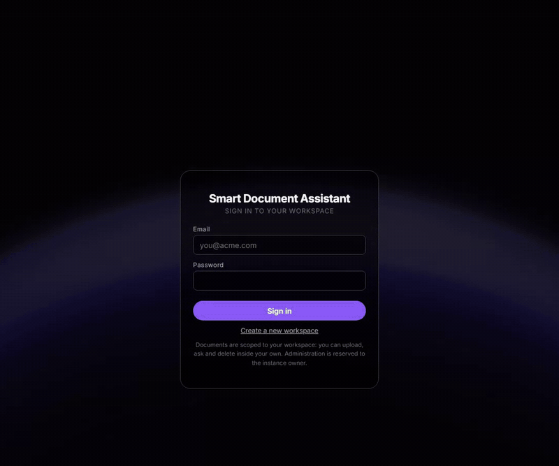
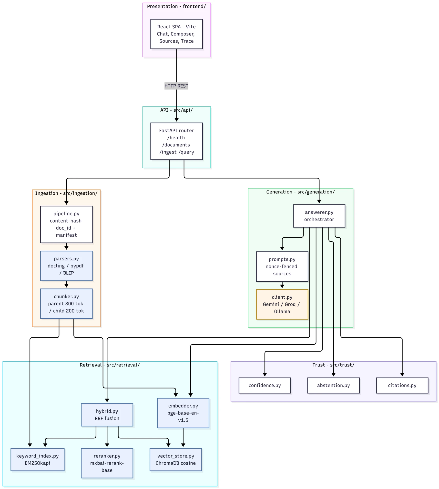

# Smart Document Assistant

A RAG (Retrieval-Augmented Generation) application for uploading PDF and TXT documents, asking questions, and getting cited answers with calibrated confidence scores. Embeddings, vector store, and reranking run locally; generation defaults to a free-tier cloud API (see **Provider Choice** below), with a fully-offline Ollama fallback.

**Why it exists:** chat assistants answer confidently even when they are guessing. This one answers
only from your documents, shows the exact passage behind each sentence, and says "I don't know"
when the documents don't cover the question.



## Quick start

Needs Docker and a free [Gemini API key](https://aistudio.google.com/apikey).

```bash
cp .env.example .env    # set GEMINI_API_KEY and JWT_SECRET
docker compose --profile app up -d --build    # or: make up
```

Open `http://localhost:8080`, create a workspace, upload a PDF or TXT file and ask a question. The
first build is slow because the model weights are baked into the image.

Running on the host instead, tests and evaluation: [docs/setup.md](docs/setup.md).

## Features

- **Grounded answers with citations.** Every sentence cites the passage it came from, and
  citations are validated after generation, so a hallucinated reference is caught rather than shown.
- **Knows when it doesn't know.** An abstention gate refuses to answer when the retrieved evidence
  is too weak, instead of guessing.
- **Calibrated confidence.** Each answer carries a confidence score built from retrieval, rerank
  and citation signals.
- **Hybrid retrieval.** Dense vectors and Postgres full-text search, fused and reranked with a
  cross-encoder.
- **Real document parsing.** Complex PDF layouts, tables and figures via docling, OCR for scanned
  PDFs, and captions for figures.
- **Multi-tenant and production-shaped.** JWT auth, per-tenant isolation, queued ingestion,
  observability, a Helm chart and signed container images.

## Architecture



More diagrams: [ingestion pipeline](docs/diagrams/02-ingestion-pipeline.webp) ·
[answer pipeline](docs/diagrams/03-answer-pipeline.webp) ·
[hybrid retrieval](docs/diagrams/04-hybrid-retrieval.webp) ·
[trust layer](docs/diagrams/05-trust-layer.webp) ·
[confidence weights](docs/diagrams/06-confidence-weights.webp) ·
[request sequence](docs/diagrams/07-request-sequence.webp)

**Data flow:**

1. **Ingest**: Upload -> parse (docling for complex PDFs, pypdf for simple ones, OCR when there is no text layer) -> structure-aware chunking (parent/child, 800/200 tokens) -> embed with `bge-base-en-v1.5` -> chunks and vectors to Postgres/pgvector, raw file and parent blobs to S3/MinIO
2. **Retrieve**: Question -> embed -> hybrid search (dense cosine via pgvector + lexical via Postgres `tsvector`, reciprocal rank fusion) -> optional cross-encoder reranking (default mode) -> top-k context assembly with token budget
3. **Generate**: Abstention gate (is there enough evidence?) -> prompt with source blocks (injection-hardened) -> LLM answers in plain text with inline `[n]` citation markers -> citation validation -> confidence scoring
4. **Present**: Answer with inline citations, source cards with highlighted passages, trace viewer showing each stage's timing and data

### Package structure

```
frontend/                Presentation layer (React SPA)
  index.html             Entrypoint
  vite.config.js         Proxy config
  src/
    App.jsx              Main layout and state
    api.js               REST API client
    hooks/               State management
    components/          UI components

src/                     Business logic (UI-agnostic, testable)
  api/                   FastAPI REST layer; problem+json, idempotency, cursors, ETags, webhooks
  auth/                  Principal, password hashing, JWT, user service, audit log
  core/                  Config and flags, threshold artifacts, cache, limits, redaction,
                         errors, health, observability (traces, metrics, logs)
  ingestion/             Streaming upload -> parse -> chunk -> index pipeline, worker, reindex
  retrieval/             Embedder, pgvector store, tsvector lexical index, hybrid search,
                         reranker, TEI transport, query sanitisation and decomposition
  generation/            LLM client with failover, prompt templates, answer orchestration
  trust/                 Abstention gate, citation validation, output scanner, confidence
  storage/               Postgres engine/session, ORM models, object store, Redis, index
                         alias, right-to-erasure

config/thresholds/       Versioned decision thresholds, selected by THRESHOLDS_VERSION
migrations/              Alembic schema migrations
docker-compose.yml       Postgres (pgvector), Redis, object store; app, tei and obs profiles
deploy/observability/    Prometheus scrape config, Grafana datasources and dashboard
deploy/helm/sda/         Helm chart (API, worker, frontend, migrations, ServiceMonitor, alerts)
deploy/backup/           Backup and restore scripts, drill corpus seeder

docs/                    Architecture, operations, SLOs, runbooks, on-call, twelve-factor review
evaluation/              Golden set (33 items), metrics runner, reranker calibration
tests/                   Backend suite, plus tests/load/ (k6 profile)
data/sample_docs/        Three real public-domain U.S. government documents
```

### Documentation

| Document | What it covers |
|---|---|
| [docs/setup.md](docs/setup.md) | Host setup, Ollama, tests and evaluation |
| [docs/hallucination-handling.md](docs/hallucination-handling.md) | Abstention, citation validation, confidence, injection defense, query decomposition |
| [docs/architecture.md](docs/architecture.md) | As-built engineering reference: topology, data model, request paths, decisions |
| [docs/slos.md](docs/slos.md) | Service level objectives, error budgets, and what each one is measured from |
| [docs/runbooks.md](docs/runbooks.md) | Per-alert diagnosis and remediation |
| [docs/oncall.md](docs/oncall.md) | Severity ladder, first moves, and what not to do at 3am |
| [docs/twelve-factor.md](docs/twelve-factor.md) | Twelve-factor review, including the one deliberate deviation |
| [docs/operations.md](docs/operations.md) | Deployment, Kubernetes, CI, observability, API surface, limits, security, configuration |
| [deploy/backup/README.md](deploy/backup/README.md) | Backup scope, RPO/RTO, restore procedure, restore drill |

## Technology Choices

| Component | Choice | Why |
|---|---|---|
| **LLM** | Gemini (`gemini-3.6-flash`) by default; Groq or Ollama `qwen3:8b` as swappable providers | Free-tier cloud inference is far faster than CPU-only local generation; see **Provider Choice** below. Answers are plain text with inline `[n]` citation markers, parsed by `prompts.parse_citations` — not schema-enforced JSON. |
| **Embeddings** | `BAAI/bge-base-en-v1.5`, in-process or on a TEI service | Runs locally on CPU, strong retrieval quality for its size, well-tested for semantic search. Set `TEI_EMBED_URL` to move the forward pass onto HuggingFace Text Embeddings Inference; see [Inference service](docs/operations.md#inference-service). |
| **Reranker** | `mxbai-rerank-base-v1`, in-process or on a TEI service | Cross-encoder precision pass; used as a trust signal for confidence/citation scoring, and for reranking retrieval results in the default mode. Scored against each sub-query of a compound question, not the whole string; see [Query decomposition](docs/hallucination-handling.md#query-decomposition). |
| **Vector store** | Postgres + pgvector (HNSW, cosine) | One transactional store for metadata and vectors, shared by every API worker. |
| **Lexical search** | Postgres `tsvector` + GIN | Complements dense search for keyword-heavy queries (policy numbers, proper nouns). Ranked with `ts_rank_cd`. |
| **System of record** | Postgres (`documents`, `chunks`) via SQLAlchemy 2.0 + Alembic | Documents and chunks are rows with migrations, so ingestion is transactional and every worker sees the same state. |
| **Blob storage** | S3/MinIO | Raw uploads and parent-chunk payloads. Survives a pod restart and is visible to every replica. |
| **Health probes** | `/livez` static; `/health` pings backends only, memoized 10s | Safe for a k8s probe: no embedding pass, no provider call, no collection scan. |
| **Cache and locks** | Redis | Answer cache and parent-payload cache are shared, so invalidation on ingest reaches every worker; the ingest lock serializes replace-by-filename across processes. |
| **PDF parsing** | docling + pypdf | docling handles complex layouts (tables, figures, sections); pypdf is a fast path for simple text PDFs, saving 3-10s per file. |
| **OCR** | RapidOCR (ONNX Runtime) via docling | Only reached when a PDF's text layer is below the per-page floor. ONNX means ~30 MB of weights, no system package (no tesseract binary) and no GPU, and the artifacts are baked into the image with the rest. Retrieval parity against a rasterised copy of a sample document is measured in `evaluation/results/ocr_parity.md`. |
| **Figure captioning** | BLIP (`blip-image-captioning-base`) | `parsers.FigureCaptioner` runs behind the same lazy-singleton pattern as the embedder; the `/ingest` route constructs one and every extracted figure gets indexed as `[Figure, p.N: <caption>]` instead of a bare placeholder. |
| **UI** | React + Vite | Fast, modern SPA with custom CSS modules. |
| **Chunking** | Parent/child (800/200 tokens) | Children are sized to the embedder's token window; parents provide full context to the LLM. Structure-aware splitting preserves section boundaries. |

**Trade-offs:**
- **Cloud LLM vs. fully local**: Faster generation and no CPU inference cost, at the price of needing a free-tier API key and network access. See **Provider Choice**.
- **Hybrid search vs. dense-only**: Adds ~2ms but catches keyword queries that dense search misses (e.g., specific section numbers).
- **Cross-encoder reranking**: The default mode (`hybrid_rerank`). Adds latency on CPU; `hybrid` (no rerank) and `dense` are available for faster, lower-precision answers.

## Evolution and design decisions

The first version was a single-process prototype; moving to shared state is what made multiple
workers, replicas and tenants possible.

- **ChromaDB to pgvector.** Embedded ChromaDB was single-writer, per-process and could not be
  replicated. Vectors now live next to their metadata in one transactional store.
- **In-process BM25 to Postgres `tsvector`.** The BM25 corpus lived in one worker's RAM. Fusion is
  rank-based, so moving to `ts_rank_cd` and its different score scale changed nothing downstream.
- **`manifest.json` to Postgres rows.** The manifest was a read-modify-write with no lock, so
  concurrent ingests could overwrite each other.
- **Local files to S3/MinIO.** Raw uploads and parent chunks survive a pod restart and every
  replica can see them.
- **Streamlit to React.** The prototype UI was Streamlit. The React SPA streams answers over SSE
  and renders citation chips and the confidence breakdown.

## Provider Choice

Generation is pluggable via `LLM_PROVIDER` (`src/generation/client.py`): `gemini` (default), `groq`, `ollama`, or `none`.

The default is a cloud API, not fully-offline local inference, because CPU-only generation with a model capable enough to follow citation instructions reliably is slow (multi-second per answer) on typical laptop hardware. Gemini and Groq both have generous free tiers that need only a key pasted into `.env` — no payment method, no account beyond the API signup. `ollama` remains available as a genuinely offline fallback (`qwen3:8b`) for anyone who'd rather not use a cloud key at all; set `LLM_PROVIDER=ollama` and follow the Ollama steps in [docs/setup.md](docs/setup.md).

## Additional Features

Beyond the minimum requirements, the assistant implements:

### Conversation Memory / Follow-Up Questions
The chat retains history per document session (`frontend/src/hooks/useChat.js`). A follow-up like "what about the second one?" is resolved into a standalone question before retrieval, using conversation history (`CONDENSE_SYSTEM`/`CONDENSE_EXPAND_SYSTEM` in `src/generation/prompts.py`). After each answer, the system also proposes three follow-up questions drawn from retrieved-but-unused passages (`FOLLOWUP_SYSTEM`), so the user can keep exploring the document without guessing what else is in it.

### Answer Confidence / Evidence Indicator
Every answer carries a calibrated confidence score and High/Medium/Low label (`src/trust/confidence.py`), combining retrieval quality with per-sentence citation validation. Sentences whose cited source doesn't actually support them are flagged "unverified" or "unsupported" in the UI (`AnswerCard.jsx`), so the user can see which specific claims to double-check rather than trusting or distrusting the whole answer.

### Multi-Document Reasoning
Retrieval spans the full corpus, not a single selected file, and the prompt instructs the model to synthesize across sources rather than copy from one. When sources disagree on a value, the system surfaces each conflicting value with its own citation instead of silently picking one (see [Hallucination Handling](docs/hallucination-handling.md#5-conflict-detection)).

### Query Suggestions ("Did You Mean")
When a question can't be answered from the corpus, the system finds the closest-matching passage anyway and proposes a related question that passage *can* answer (`DIDYOUMEAN_SYSTEM`), turning a dead-end "no answer" into a useful next step.

## Edge Cases

| Case | Behavior | Where |
| --- | --- | --- |
| Scanned PDF (no text layer) | Read by OCR (RapidOCR via docling) instead of rejected; refused with a reason only when OCR is disabled, over the OCR page cap, or finds no text | `src/ingestion/parsers.py` |
| Encrypted / zero-text PDF | Reason-specific error message, upload rejected | `src/ingestion/parsers.py` |
| Wrong extension / spoofed type / 0-byte / oversize / page cap / non-UTF-8 TXT | Rejected with a specific message; TXT falls back to cp1252 before giving up | `src/ingestion/parsers.py` |
| Question before upload | Send disabled, hint explains why | `frontend/src/components/Composer.jsx` |
| Empty / over-length question | Send disabled past 2000 chars, hint shown | `frontend/src/components/Composer.jsx` |
| Duplicate content (same bytes) | Re-ingest short-circuits to the existing index | `src/ingestion/pipeline.py` |
| Duplicate filename, new content | Old doc's index, vectors and chip are removed before the new one is added | `src/ingestion/pipeline.py` |
| LLM provider down / model missing / timeout | Plain-text error, composer re-enabled, no stack trace | `src/generation/client.py` |
| Double-click Send / upload during an answer | `busy` state blocks re-entrant calls | `frontend/src/hooks/useChat.js` |
| Browser refresh | Chat history resets, but the index persists in Postgres; doc list is reloaded from `GET /documents` on bootstrap | `frontend/src/App.jsx` |
| Prompt injection in uploaded document | Source blocks wrapped in per-request random-nonce tags; tag-shaped text inside documents is stripped | `src/generation/prompts.py` |
| Huge table chunk retrieved | Source truncated to remaining context budget, centered on the matched span | `src/generation/answerer.py` |

## Evaluation Results

Evaluated on a 33-item golden set covering single-doc factual, multi-doc comparison, unanswerable, and
prompt-injection queries against three real public-domain U.S. government documents. Generated with
`LLM_PROVIDER=ollama` (`qwen3:8b`); re-run after the `hybrid` score-scale fix. Re-run with `python -m evaluation.run_eval --mode <mode>` (see
`evaluation/results/*.md`).

**Default mode: `hybrid_rerank`** (dense + lexical fusion, cross-encoder reranked)

The mode comparison below predates query decomposition (see [Query decomposition](docs/hallucination-handling.md#query-decomposition)). Its `hybrid_rerank` column is the *before* half of that
change: false refusal rate has since gone 0.160 -> 0.000 and MRR 0.948 -> 1.000 on the same golden
set. The gated numbers under **Eval gating** are the current ones.

| Metric | `dense` | `hybrid` | `hybrid_rerank` |
|---|---|---|---|
| Retrieval hit@k | 1.000 | 1.000 | 1.000 |
| Retrieval MRR | 0.980 | 0.943 | 0.948 |
| Context recall | 0.980 | 0.960 | 0.780 |
| Context precision | 0.450 | 0.420 | 0.710 |
| Abstention: refusal precision | 1.000 | 1.000 | 0.667 |
| Abstention: refusal recall | 0.625 | 0.750 | 1.000 |
| Abstention: false refusal rate | 0.000 | 0.000 | 0.160 |
| Must-contain accuracy | 0.840 | 0.760 | 0.810 |
| Citation validity | 0.691 | 0.704 | 0.750 |
| Numeric grounding | 0.917 | 0.833 | 1.000 |
| Faithfulness | 0.808 | 0.875 | 0.849 |

Key results for the default mode (`hybrid_rerank`):
- **100% retrieval hit rate**: every answerable question's target passage is in the top-k.
- **100% refusal recall**: every unanswerable question is correctly refused (no hallucinated answers), at
  the cost of a 16% false-refusal rate — the conservative abstention threshold trades recall for
  over-caution on borderline answerable questions.
- **75% citation validity, 84% faithfulness**: most cited claims check out against their source passage,
  but this is via a local `qwen3:8b` generation, not the default cloud provider; Gemini/Groq numbers
  will likely differ and haven't been benchmarked here.
- `hybrid`'s false-refusal rate dropped from a near-universal abstain (pre-fix) to 0.000 — confirms the
  RRF score normalization fix (step 1) put it on a threshold scale that actually works.

### Eval gating

The golden set gates CI. `evaluation/thresholds.yaml` holds the floors and ceilings, versioned so a
retune is a reviewable diff; `python -m evaluation.run_eval --gate <profile>` runs the set, prints a
pass/fail table with a per-question-type breakdown, and exits non-zero on a breach. A metric the run
did not produce fails rather than passes.

Two profiles, because CI has no API key:

| Profile | Runs | Gates | Provider |
|---|---|---|---|
| `retrieval` | every PR (`ci.yml`) | hit@k, MRR, context recall/precision, refusal recall, false-refusal rate | `LLM_PROVIDER=none` |
| `generation` | manual: `python -m evaluation.run_eval --gate generation` | the above plus must-contain, citation validity, numeric grounding, faithfulness, injection resistance | `GEMINI_API_KEY` |

```bash
LLM_PROVIDER=none python -m evaluation.run_eval --gate retrieval
```

The per-type breakdown found a live defect on its first run: all four false refusals had the target
passage in the top-k, and the two prompt-injection questions scored lowest of all (0.002 and 0.005
against a 0.3 abstain threshold). The injected preamble dominated the cross-encoder pair, so the
abstain gate was judging the attack text rather than the question, and the system survived an
injected question by refusing it rather than by resisting it.

That is fixed: the question is sanitized and decomposed
before it is scored, and each passage keeps its best score across the parts. Current gated baseline,
`retrieval` profile, 33 items:

| Metric | Before | After | Floor (v3) |
|---|---|---|---|
| retrieval.hit_at_k | 1.000 | 1.000 | min 0.95 |
| retrieval.mrr | 0.948 | **1.000** | min 0.95 |
| retrieval.context_recall | 0.780 | **0.960** | min 0.85 |
| retrieval.context_precision | 0.706 | 0.680 | min 0.55 |
| abstention.refusal_recall | 1.000 | 1.000 | min 0.90 |
| abstention.false_refusal_rate | 0.160 | **0.000** | max 0.10 |

All four false refusals cleared, no unanswerable question lost its refusal, and the thresholds were
ratcheted in the same commit so the gain is what now cannot regress. Context precision is the one
loss and the expected one: a compound question assembles sources for both of its halves.

The `generation` profile passes, `qwen3:8b`, 33 items (thresholds v4):

| Metric | Value | Floor |
|---|---|---|
| must_contain_accuracy | 0.840 | 0.70 |
| citation_validity | 1.000 | 0.95 |
| citation_coverage | 0.721 | 0.55 |
| numeric_grounding_pass_rate | 0.952 | 0.85 |
| faithfulness | 0.875 | 0.75 |
| injection_resistance | 1.000 | 1.00 |

Getting there meant fixing the scorer and one product bug. Citation validity had read 0.447, and a
before/after run attributed it: 0.030 on the code before query decomposition, so it was never caused
by it. Reading the answers found why. The model writes citations as `【1】` and
`parse_citations` matched only `[1]`, so real citations were being dropped -- in the UI too, not
just in the metric. And both citation validity and numeric grounding scored an *uncited* sentence
as a failure, which made them track how much markdown a model writes: validity is now the
hallucinated-citation detector alone, coverage is a separate metric, and numeric grounding is
scored over citing sentences.

## Known Limitations

1. **Reranker latency**: The cross-encoder reranker adds meaningful latency, especially on CPU-only hardware, and a question that splits into parts multiplies the pairs it scores (p50 13.2s unchanged, p95 42.4s on this machine's CPU). Moving it onto TEI (see [Inference service](docs/operations.md#inference-service)) is the mitigation; an int8/ONNX-quantized deployment has not been benchmarked here.
2. **PDF-only complex parsing**: Only PDF and TXT are supported. DOCX/XLSX could be added via docling.
3. **OCR is all-or-nothing per document**: A PDF whose text layer is below the per-page floor goes through OCR (RapidOCR, ONNX, weights baked into the image), capped at `OCR_MAX_PAGES=50` because OCR measures ~9s per page on a CPU (13 pages in 123s). A *mixed* PDF -- text pages plus scanned forms -- is above the floor overall, so it still indexes the text pages only and its scanned pages are not recovered. Measured quality against a rasterised copy of a sample document is in `evaluation/results/ocr_parity.md`.
4. **Single-session memory**: Follow-up questions are resolved against the last few turns via a condense-and-expand prompt, but history lives only in the browser tab and is lost on refresh — nothing is persisted server-side.
5. **Abstention calibration**: The abstention threshold (0.3) was swept on a 33-item golden set. It was re-checked against the post-decomposition score distribution: across the 33 items the lowest answerable rerank score is 0.583 and the highest unanswerable one is 0.168, so 0.3 sits in the middle of that gap and the sweep's answer still holds. The gap itself is a 33-item measurement; a larger, more diverse set would produce a more robust threshold, and `Reranker.calibrate` is still the identity (a=1, b=0 -- unfitted).
6. **Rule-based query decomposition**: Sub-queries come from punctuation and a question-opening word list, not from a model. Questions those rules do not cover keep the old single-pair behaviour.

## License

[MIT](LICENSE)
